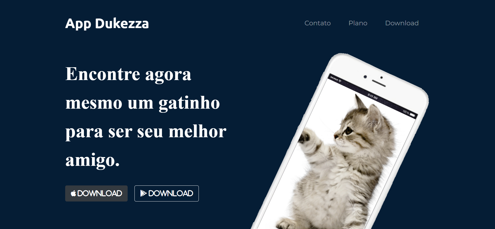

<h1 align="center"> App Dukezza </h1>

Projeto exclusivo do curso tipscode.

 

  

## 🚀 Tecnologias

Esse projeto foi desenvolvido com as seguintes tecnologias:

- HTML e CSS
- JavaScript
- Git e Github
- Bootstrap

## 💻 Projeto

O Projeto é um app para encontra outro gato para fazer companhia.